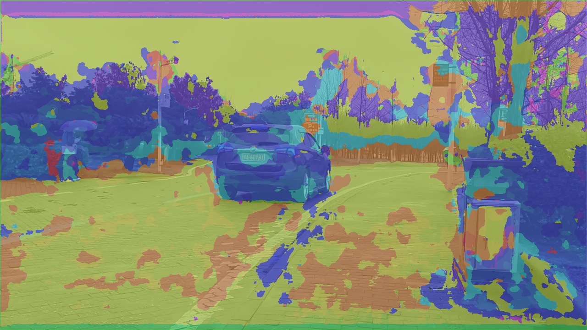
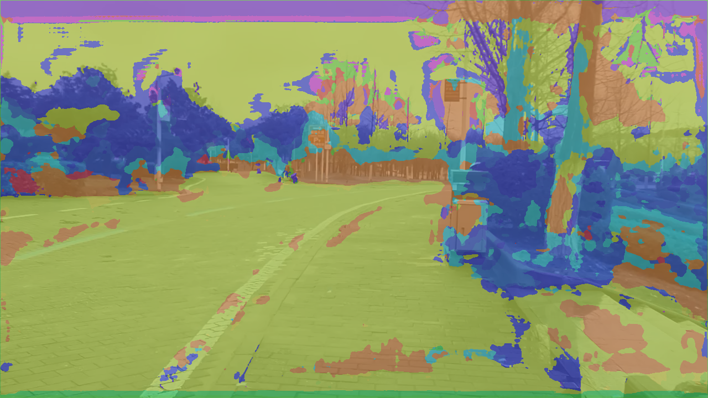

# Unet

使用 **Unet** 进行语义分割训练。

该项目为[Richy Mao](https://github.com/Richard17425 "Richard17425") 参与 *MIT Frontier Research Program: Deep Learning in Computer Vision for the 2023 winter term* 中的课程作业。原版[网址](https://github.com/Richard17425/Deep-Learning-in-Computer-Vision/blob/main/homework/SoftwareLabPart2/work_SoftwareLab2.ipynb) 。

个人进行了Unet改写，dataset的重写、以及net training。

训练集 图片大小 128×256×3，标签图片为同大小的1通道图片。

之后对代码进行扩展，在原数据集上进行更多次训练，训练结果如下：

| IoU                                                                                      | loss                                                                                      |
| ---------------------------------------------------------------------------------------- | ----------------------------------------------------------------------------------------- |
|  |  |

 epoch = 30 时，训练集IoU = 0.3。

loss曲线：

在个人录制视频*test.mp4* 中对神经网络进行部署并通过 **cv2** 将结果导出为视频

输入视频为 15714 × 720 × 1080 × 3  (fps = 30)

以原图对视频帧进行分割，效果如下所示:

|          col1          | col2                       |
| :---------------------: | -------------------------- |
|  |  |
|  |     |
